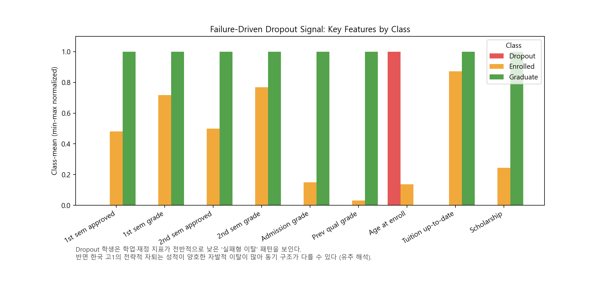

# 중퇴 예측으로 읽는 한국 고1 자퇴 급증

해외 교육 데이터로 학생의 중도 이탈을 예측하고, 그 결과를 통해 최근 급증한 한국 고등학교 1학년 자퇴 현상을 유추적으로 해석하는 **1인 개인 프로젝트**입니다. 포르투갈 고등교육기관의 `Predict students' dropout and academic success` 데이터셋을 사용하여 전통적 머신러닝 모델과 MLP 딥러닝 모델을 비교하고, 중도 이탈 예측에 중요한 요인을 해석합니다.

## Motivation

최근 보도에 따르면 한국에서 고등학교 1학년 자퇴자 수가 처음으로 연 1만 명을 넘어서며 사회 문제로 떠올랐습니다. 다만 이 자퇴의 상당수는 학업 실패나 부적응에 의한 이탈이 아니라, **자퇴 후 검정고시·수능에 집중하기 위한 "전략적 자퇴"**라는 점이 한국적 특수성입니다.

여기서 출발한 질문은 다음과 같습니다.

- 학생의 중도 이탈은 데이터로 예측 가능한가? 가능하다면 어떤 요인이 신호로 작동하는가?
- 해외(포르투갈 고등교육) 데이터에서 드러나는 "이탈의 구조"를, 맥락이 다른 한국 고1 자퇴 현상에 얼마나, 그리고 어떻게 유추할 수 있는가?
- 학업·재정 실패형 이탈과 한국형 전략적 자퇴는 무엇이 같고 무엇이 다른가?

직접적으로 동일한 한국 고1 자퇴 데이터를 구하기 어렵기 때문에, 공개된 해외 교육 데이터에서 중도 이탈의 일반적 구조를 학습한 뒤, 그 해석을 한국 상황에 **조심스럽게 유추**하는 우회 전략을 택했습니다. 이 프로젝트의 가치는 "한국 자퇴를 정확히 예측한다"가 아니라, **데이터가 말하는 이탈의 신호와 한국적 자퇴 동기 사이의 간극을 드러내는 데** 있습니다.

## Project Overview

이 프로젝트는 학생 데이터를 바탕으로 `Dropout`(중도 이탈), `Enrolled`(재학 중), `Graduate`(졸업) 세 클래스를 분류하는 tabular classification 문제를 다룹니다. 단순히 성능이 높은 모델을 찾는 데 그치지 않고, 어떤 변수들이 학생의 학업 지속 가능성과 관련되어 있는지 feature importance를 통해 함께 분석하고, 그 결과를 한국 고1 자퇴 맥락에 대한 해석으로 연결합니다.

핵심 질문은 다음과 같습니다.

- 전통적 머신러닝 모델과 MLP 중 어떤 모델이 이 데이터 구조에 더 적합한가?
- 모델 성능뿐 아니라, 어떤 요인이 중도 이탈 예측에 중요하게 작용하는가?
- 이 신호 구조를 한국 고1 자퇴(특히 전략적 자퇴) 해석에 유추할 때 무엇을 얻고 무엇을 경계해야 하는가?

## Dataset

- Dataset name: `Predict students' dropout and academic success`
- Kaggle URL: https://www.kaggle.com/datasets/thedevastator/higher-education-predictors-of-student-retention
- UCI mirror: https://archive.ics.uci.edu/dataset/697/predict+students+dropout+and+academic+success
- 출처/맥락: **포르투갈 고등교육기관**의 학생 데이터입니다. (한국 데이터나 미국 데이터가 아닙니다.)
- Dataset size: 4,424 rows / 36 input columns + target
- Target classes: `Dropout`, `Enrolled`, `Graduate`

> 데이터 맥락에 대한 정직한 명시: 본 데이터는 포르투갈 **대학(고등교육)** 데이터이며, 한국 **고등학교 1학년** 자퇴와는 교육 단계·제도·이탈 동기가 다릅니다. 따라서 한국 상황에 대한 모든 서술은 "예측"이 아니라 "유추적 해석"으로 제한됩니다. 자세한 내용은 아래 [유추의 범위와 한계](#유추의-범위와-한계) 참고.

원본 CSV는 용량과 재배포 조건을 고려하여 Git에는 포함하지 않습니다. 실행하려면 Kaggle 또는 UCI에서 받은 CSV 파일을 `data/raw/` 아래에 넣어 주세요.

```text
data/raw/student_dropout_success/data.csv
```

## Key Insights

이 프로젝트의 핵심은 단순한 성능 비교보다, 어떤 요인이 중도 이탈 예측에 영향을 주는지 해석 가능한 단서를 찾고 이를 한국 맥락에 연결하는 데 있습니다.

- Random Forest 계열 모델이 MLP보다 안정적인 성능을 보였습니다.
- 이 데이터는 4,424행 규모의 tabular dataset이므로, tree-based ensemble이 변수 간 비선형 관계와 feature interaction을 효과적으로 포착한 것으로 해석할 수 있습니다.
- Feature importance 분석 결과, 학기별 승인 과목 수와 성적, 학기별 평가 횟수, 등록금 납부 여부, 장학금 여부 등이 주요 변수로 나타났습니다.
- 이는 중도 이탈이 입학 당시 정보보다 **입학 후 학업 진행 상황과 재정·행정 상태**에 강하게 연결되어 있음을 시사합니다.
- **한국 유추 관점:** 데이터가 가리키는 이탈 신호는 "학업·재정 누적 실패"에 가깝습니다. 반면 한국 고1의 전략적 자퇴는 오히려 성적이 나쁘지 않은 학생이 더 나은 입시 전략을 위해 선택하는 경우가 많습니다. 즉 동일한 "이탈"이라도 한국형 자퇴는 데이터가 학습한 실패형 이탈과 동기가 반대일 수 있으며, 이 간극 자체가 중요한 발견입니다.
- 단, 변수 중요도는 인과관계를 의미하지 않으며, 실제 조기경보 모델로 활용하려면 입학 정보 또는 1학기 정보만 사용하는 별도 실험이 필요합니다.

## Visualizations

`reports/figures/`에 생성되는 주요 시각화 자료입니다. (생성 방법은 [How to Run](#how-to-run) 참고)

| 그림 | 설명 |
| --- | --- |
| `class_distribution.png` | target 클래스 분포 (class imbalance 확인) |
| `key_feature_distributions.png` | 클래스별 핵심 변수 분포 (boxplot) |
| `model_performance.png` | macro F1 기준 모델 성능 비교 |
| `experiment_comparison.png` | PCA/SMOTE ablation 비교 |
| `feature_importance.png` | Random Forest 변수 중요도 |
| `best_confusion_matrix.png` | 최고 모델 confusion matrix |
| `correlation_heatmap.png` | 핵심 수치형 변수 간 상관관계 |
| `pca_projection.png` | 2D PCA projection에서의 클래스 분포 및 중첩 |
| `per_class_metrics.png` | 최고 모델의 클래스별 precision/recall/F1 (Enrolled가 가장 어려움) |
| `dropout_signal_by_class.png` | 클래스별 핵심 변수 평균 — **Dropout의 실패형 이탈 신호와 한국형 전략적 자퇴의 대비** |

이 프로젝트의 핵심 그림은 `dropout_signal_by_class.png`입니다. 데이터의 Dropout 집단은 학업·재정 지표가 전반적으로 가장 낮은 "실패형 이탈" 패턴을 보이며, 이는 성적이 양호한 학생의 자발적 선택인 한국형 전략적 자퇴와 동기 구조가 다를 수 있음을 시각적으로 드러냅니다.



## 유추의 범위와 한계

이 프로젝트가 한국 고1 자퇴를 직접 예측하지 않는다는 점을 분명히 합니다. 해외 데이터에서 얻은 결과를 한국에 연결할 때의 전제와 경계는 다음과 같습니다.

- **교육 단계 차이:** 포르투갈 대학생 vs 한국 고1. 학업 구조, 졸업·진급 의미가 다릅니다.
- **이탈 동기 차이:** 데이터의 `Dropout`은 학업·재정 실패형 이탈을 주로 포착합니다. 한국 고1 자퇴는 상당수가 검정고시·수능 집중을 위한 **자발적·전략적 선택**이므로, 신호 구조가 다를 수 있습니다.
- **유추가 유효한 지점:** "재정/행정 상태(등록금·장학금)와 초기 학업 성과가 지속 여부와 연결된다"는 일반적 구조는, 한국에서 경제적 사유나 학업 부적응으로 인한 비전략적 자퇴를 이해하는 데 참고가 될 수 있습니다.
- **유추가 위험한 지점:** 모델이 "성적·과목 이수 부진 = 이탈 위험"으로 학습했기 때문에, 전략적 자퇴(성적이 양호한 자발적 이탈)를 그대로 적용하면 정반대 해석을 낳을 수 있습니다.
- 따라서 본 보고서의 한국 관련 서술은 모두 정책 제언이 아닌 **가설·해석 수준**이며, 실제 적용에는 한국 자체 데이터 확보와 도메인 검증이 필요합니다.

## Methodology

전처리는 `scripts/prepare_data.py`에서 수행합니다.

- CSV 자동 탐색 또는 `--input`으로 지정한 CSV 로드
- BOM, 앞뒤 공백, 탭 등 컬럼명 정리
- target 컬럼 자동 추론
- 중복 행 제거
- `stratify=y`를 적용한 train/test split
- 숫자형 변수 표준화
- 명목형 코드 변수 one-hot encoding
- 선택 옵션으로 PCA 및 SMOTE 적용
- 전처리된 데이터와 preprocessor를 `data/processed/`에 저장

비교한 모델은 Logistic Regression, SVM with RBF kernel, Random Forest, MLP trained with SGD/backpropagation입니다. KMeans는 비지도 분석 참고용으로 사용했습니다.

## Key Results

현재 결과 파일 기준 가장 좋은 모델은 `random_forest`입니다.

```text
macro_f1 = 0.7032
accuracy = 0.7627
weighted_f1 = 0.7609
```

MLP는 `macro_f1 = 0.6898`, `accuracy = 0.7525`를 기록했습니다. PCA/SMOTE ablation은 보조 실험으로 유지했으며, 전체 결론은 동일한 전처리와 split 안에서 모델들을 비교한 결과를 중심으로 해석했습니다.

본 모델은 학생의 최종 상태를 단정하는 도구가 아니라, 지원이 필요할 가능성이 있는 학생을 더 빨리 살펴보기 위한 decision-support 관점에서 해석하는 것이 적절합니다. 한국 자퇴 맥락에 대한 서술은 예측이 아닌 유추적 해석으로만 사용합니다.

## Limitations

- 현재 기본 실험은 1학기 및 2학기 학업 성과 변수를 모두 사용하므로, 결과는 "최종 상태 분류" 관점으로 해석하는 것이 적절합니다.
- 일부 중요 변수는 학기별 성과 변수이므로 입학 직후의 조기 예측에는 사용할 수 없을 수 있습니다.
- feature importance는 상관적 신호를 보여줄 뿐 인과관계를 증명하지 않습니다.
- 데이터셋 규모가 비교적 작기 때문에 MLP가 충분한 representation learning 이점을 얻기 어려울 수 있습니다.
- **데이터는 포르투갈 고등교육 맥락이므로, 한국 고1 자퇴에 대한 해석은 유추 수준이며 직접적인 예측·정책 근거로 사용할 수 없습니다.**
- 예측 결과는 학생 지원을 위한 참고 자료로 사용해야 하며, 학생에 대한 최종 판단이나 불이익 부여에 사용되어서는 안 됩니다.

## How to Run

1. 필요한 패키지를 설치합니다.

```powershell
pip install -r requirements.txt
```

2. 데이터 CSV를 `data/raw/` 아래에 넣고 전처리를 실행합니다.

```powershell
python scripts/prepare_data.py
```

target 컬럼을 직접 지정하려면 다음처럼 실행합니다.

```powershell
python scripts/prepare_data.py --target Target
```

3. 기본 머신러닝 모델을 학습합니다.

```powershell
python scripts/train_ml.py
```

4. MLP 모델을 학습합니다.

```powershell
python scripts/train_mlp.py
```

5. GridSearchCV로 머신러닝 모델을 튜닝합니다.

```powershell
python scripts/tune_ml.py
```

6. PCA/SMOTE 비교 실험을 실행하고 결과를 요약합니다.

```powershell
python scripts/run_experiments.py
python scripts/summarize_metrics.py
```

7. Confusion matrix와 feature importance 분석 파일을 생성합니다.

```powershell
python scripts/analyze_results.py
```

8. 최종 보고서, 발표 자료, 가이드라인 맞춤 산출물을 생성합니다.

```powershell
python scripts/generate_final_assets.py
python scripts/generate_guideline_assets.py
```

9. 추가 시각화 자료(상관관계 히트맵, PCA projection, 클래스별 지표, 실패형 이탈 신호)를 생성합니다.

```powershell
python scripts/generate_extra_figures.py
```

## Repository Structure

- `src/data.py`: 데이터 로드, 컬럼명 정리, target 추론, 전처리, split 저장
- `src/evaluation.py`: 공통 평가 지표 계산
- `scripts/prepare_data.py`: 전처리 실행
- `scripts/train_ml.py`: 기본 ML 모델 학습
- `scripts/train_mlp.py`: MLP 학습
- `scripts/tune_ml.py`: GridSearchCV 튜닝
- `scripts/run_experiments.py`: PCA/SMOTE 실험
- `scripts/analyze_results.py`: confusion matrix 및 feature importance 생성
- `scripts/generate_final_assets.py`: 일반 최종 보고서/슬라이드 생성
- `scripts/generate_guideline_assets.py`: 보고서/appendix 생성
- `scripts/generate_extra_figures.py`: 추가 시각화(상관관계 히트맵, PCA projection, 클래스별 지표, 실패형 이탈 신호) 생성
- `reports/metrics/summary.csv`: 전체 모델 성능 요약
- `reports/metrics/random_forest_tuned_feature_importance.csv`: 변수 중요도
- `reports/final_report.md`: 최종 보고서
- `reports/presentation_slides.html`: 발표 슬라이드 HTML

## Public Code Baseline

참고한 Kaggle public code 3개는 외부 baseline/reference로 사용했습니다. 다만 Kaggle notebook의 정확한 split과 metric을 동일하게 재현한 것은 아니므로, 본 보고서에서는 "public code보다 절대적으로 우수하다"고 주장하지 않습니다. 대신 동일한 전처리와 train/test split 안에서 ML/DL 모델을 공정하게 비교하고, PCA/SMOTE ablation과 오류 분석을 추가한 점, 그리고 결과를 한국 고1 자퇴 현상에 대한 유추적 해석으로 확장한 점을 originality로 정리했습니다.
